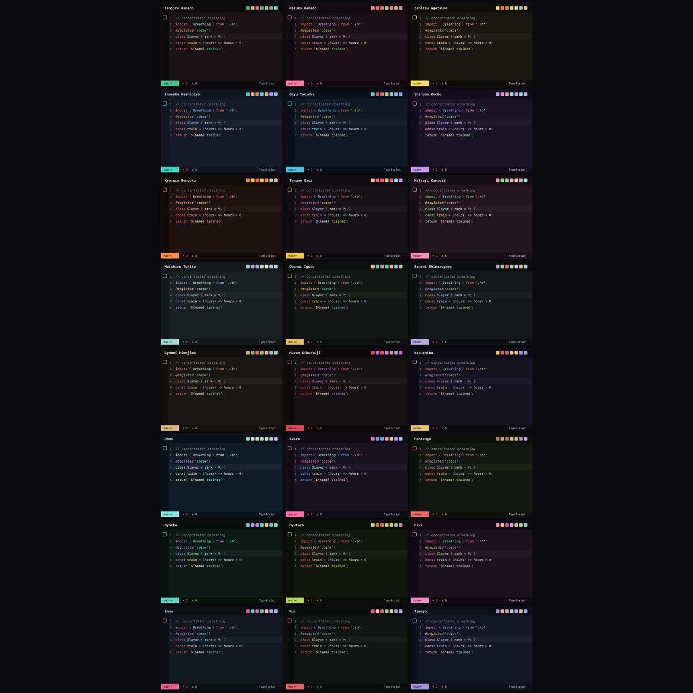
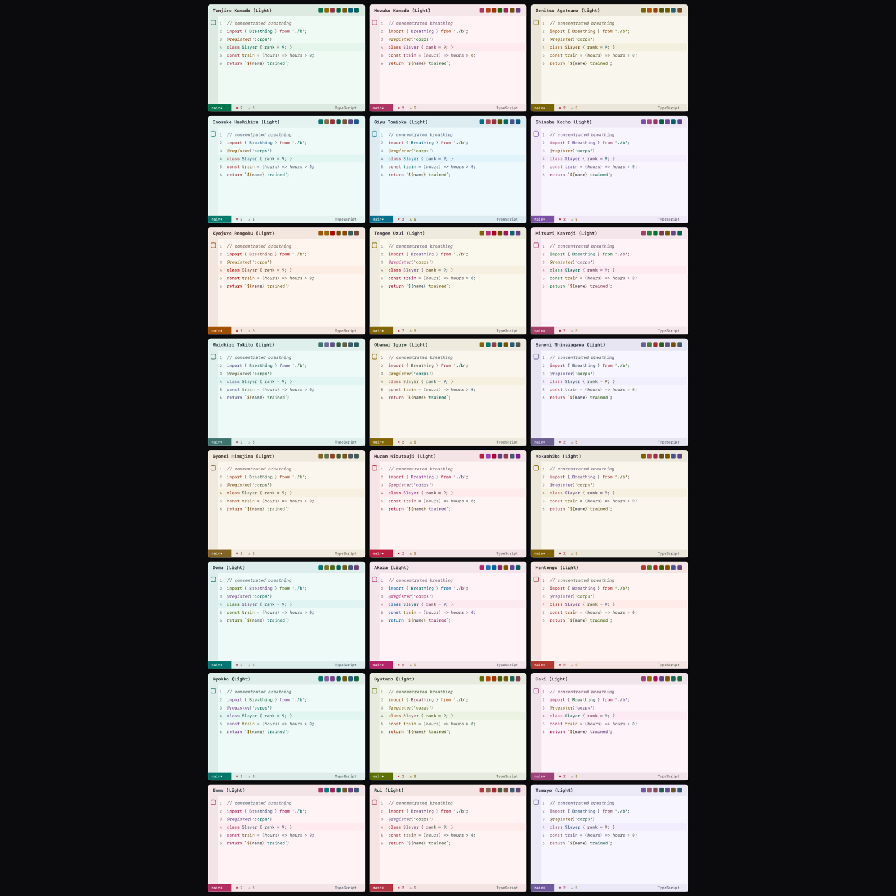

# Demon Slayer Theme

Forty-eight color themes for VS Code: twenty-four characters, each in a dark and
a light variant.

Every theme is built from a character's whole palette — not one accent color
dropped on a neutral grey. The background carries their tone, the syntax colors
come from what they actually wear and fight with, and the shape of the interface
follows: Tanjiro's checkered haori becomes the widest gap between sidebar and
editor in the set, while Inosuke's surfaces barely separate at all.

Every syntax color in all 48 variants clears **WCAG AA (≥ 4.5:1)** against its
editor background.



## Install

Once published, search for **Demon Slayer Theme** in the Extensions view
(`Ctrl+Shift+X` / `Cmd+Shift+X`), or:

```bash
code --install-extension MatheusMontemurro.demon-slayer-theme
```

Then pick a theme with `Ctrl+K Ctrl+T` / `Cmd+K Cmd+T`. All of them are listed
as `Demon Slayer — <name>`, with light variants suffixed `(Light)`.

Until then — or to try a local build — run `npm run package` and install the
resulting `.vsix` through **Extensions: Install from VSIX…**.

## The themes

### Protagonists

| Theme | Idea |
| --- | --- |
| **Tanjiro Kamado** | Wine-black from his hair and eyes, haori green as the accent, hanafuda gold in functions. The widest sidebar-to-editor jump in the set: the checker pattern turned into a rhythm of surfaces. |
| **Nezuko Kamado** | Black hair roots, the pink of her kimono taking over the whole interface, red-orange obi in keywords and bamboo in strings. |
| **Zenitsu Agatsuma** | Warm charcoal uniform, haori cream in the text, lightning yellow as the accent. The highest-contrast theme of the set. |
| **Inosuke Hashibira** | Indigo hair, turquoise tips as the accent, boar-pelt beige in functions. Surfaces that barely separate — the unpolished one. |

### Hashira

| Theme | Idea |
| --- | --- |
| **Giyu Tomioka** | Deep night blue, Water Breathing cyan as the accent; his split haori becomes wine in keywords and lime green in strings. |
| **Shinobu Kocho** | Violet-black, butterfly-wing lavender as the accent, gradient pink in keywords and wisteria green in strings. The most delicate one. |
| **Kyojuro Rengoku** | Ember charcoal, flame orange as the accent, the red of his hair tips in keywords; smoke green is the only cool anchor. |
| **Tengen Uzui** | Stage black set with jewels: headband gold as the accent, face-marking magenta in functions. The flashiest one. |
| **Mitsuri Kanroji** | Her hair gradient is the theme: pink as the accent and in strings, green in keywords — inverting the usual. |
| **Muichiro Tokito** | Mist: blue-grey instead of black, an entirely pastel palette and surfaces that hardly separate. |
| **Obanai Iguro** | His heterochromia decides everything: gold as the accent, turquoise in strings, over scale-green black. |
| **Sanemi Shinazugawa** | Cold slate, the lilac of his eyes as the accent, wind green in strings and scar red in keywords. |
| **Gyomei Himejima** | Warm stone: prayer-bead sand as the accent, moss in strings, terracotta in keywords. The heaviest one. |

### Demons

| Theme | Idea |
| --- | --- |
| **Muzan Kibutsuji** | Black with a red vein, the crimson of his eyes as the accent, demon-form violet in types. The coldest and hardest one. |
| **Kokushibo** | Upper Rank One: midnight indigo, the gold of Moon Breathing's crescents as the accent, the blood of his six eyes in keywords. |
| **Doma** | Upper Rank Two: ice blue, his Blood Demon Art as the accent and the yellow-green of his iridescent eyes in keywords. A theme made of glass. |
| **Akaza** | Upper Rank Three: hair magenta as the accent, tattoo blue in keywords, eye yellow in functions. |
| **Hantengu** | Upper Rank Four: his four emotions split the syntax — Sekido's anger in keywords, Karaku's pleasure in strings, Urogi's joy in functions, Aizetsu's sorrow in numbers. |
| **Gyokko** | Upper Rank Five: deep sea, the sea green of his scales as the accent, eye violet in keywords and pot-rim gold in functions. |
| **Gyutaro** | Upper Rank Six, the brother: sickly green background and strings, blood orange sickles in keywords. Uncomfortable on purpose. |
| **Daki** | Upper Rank Six, the sister: plum background, obi pink as the accent, sash lilac in strings and ornament gold in functions. |
| **Enmu** | Lower Rank One: a train car at night, the pink of his eyes as the accent, sea-green hair in strings and dream violet in numbers. |
| **Rui** | Lower Rank Five: forest black, the crimson of his spider thread as the accent and in keywords, pine green in strings. |
| **Tamayo** | The allied demon: kimono indigo, dusty lavender as the accent, medicine green in strings. Half a tone below everything else. |

Per-theme previews of the dark variants live in `images/preview-<id>.png`.

> The images are mockups rendered from the palettes themselves, not real
> screenshots. Replace them before publishing.

## Light variants



The light themes are not inversions, and they are not separate palettes. They
are **derived** from the dark ones in OKLCH, keeping every role's hue and
remapping only lightness. (OKLCH, not HSL: in HSL, darkening a yellow turns it
olive.)

Two choices give them their character:

- **the background** is the character's accent hue at near-white — their
  signature tinting the paper (Zenitsu turns cream, Nezuko pale pink, Giyu
  shallow-water blue);
- **the text** is the hue of their dark background at near-black — their shadow
  tone becoming the ink.

The gap between editor and chrome is carried over proportionally, so Tanjiro's
checkered rhythm stays pronounced and Inosuke's stays flat. After derivation,
every syntax color is darkened until it clears AA against the new background.

To correct one light variant, add `lightOverrides` to its dark palette; only the
keys you set replace the derived values.

## How it works

The files in `themes/` are **generated** — don't edit them by hand:

```
src/palettes/<id>.mjs   →   src/build/theme.mjs   →   themes/<id>-color-theme.json
   which colors                where each goes            what VS Code reads
                                      ↓
                            src/build/light.mjs
                          the derived light variant
```

Each character is described by a palette of 57 colors (21 interface, 16
terminal, 20 syntax). The generator expands that into ~300 workbench keys plus
syntax and semantic tokens, twice — once for the dark palette and once for its
derived light counterpart. That is 1,368 hand-written colors across the
twenty-four palettes, and roughly 14,400 generated keys.

The payoff is that a new character costs one palette file, and a change to the
mapping (say, "comments should tint the gutter too") lands on all forty-eight at
once.

## Development

```bash
npm install
npm run build     # writes themes/*.json and syncs contributes.themes
npm run check     # fails if the generated themes are stale (used in CI)
```

Press `F5` to open a development window with the extension loaded, then pick a
theme with `Ctrl+K Ctrl+T`. The files in `samples/` (TypeScript, Python, CSS,
Markdown) are there to eyeball the syntax colors. After changing colors, run
`npm run build` and then **Developer: Reload Window**.

## Adding a character

1. Create `src/palettes/<id>.mjs`:

   ```js
   import { definePalette } from './_schema.mjs';

   export default definePalette({
     id: 'yoriichi',
     label: 'Demon Slayer — Yoriichi Tsugikuni',
     type: 'dark',
     ui: { /* ... */ },
     ansi: { /* ... */ },
     syntax: { /* ... */ },
   });
   ```

2. Register it in `src/palettes/index.mjs`.
3. Run `npm run build`. The light variant comes along for free.

`definePalette` validates on the spot: a missing key, an extra key or a value
that isn't `#rrggbb` breaks the build with a list of what's wrong. The full
contract, with what each key paints, is in `src/palettes/_schema.mjs` — read it
before writing a palette.

Palettes carry six-digit hex only. Transparency is the generator's job, and it
applies alpha where it belongs (selection, hover, overview ruler).

What makes a palette read as its character, in order of impact:

1. **the background** carries the character's own dark tone, not a neutral grey;
2. **the colors come from the whole character** — hair, eyes, garment, weapon,
   technique — rather than one accent hue repeated;
3. **the structure varies**: the `bg`/`bgDeep` gap is a design decision, and it
   is what makes Tanjiro feel checkered and Inosuke feel raw.

## Publishing

`images/icon.png` is generated (four accent colors on a diagonal) — replace it
with final artwork before the first publish.

```bash
npx vsce package          # builds the .vsix locally
npx vsce publish          # needs an Azure DevOps PAT and the publisher set up
```

## Structure

```
.
├── src/
│   ├── palettes/         # the colors (one character per file) + the contract
│   └── build/            # generator, light derivation, color utilities
├── themes/               # GENERATED — do not edit
├── samples/              # files for eyeballing syntax colors
├── images/               # icon, galleries and per-theme previews
└── .github/workflows/    # CI: themes up to date + packaging
```

## License

MIT — see [LICENSE](LICENSE).
